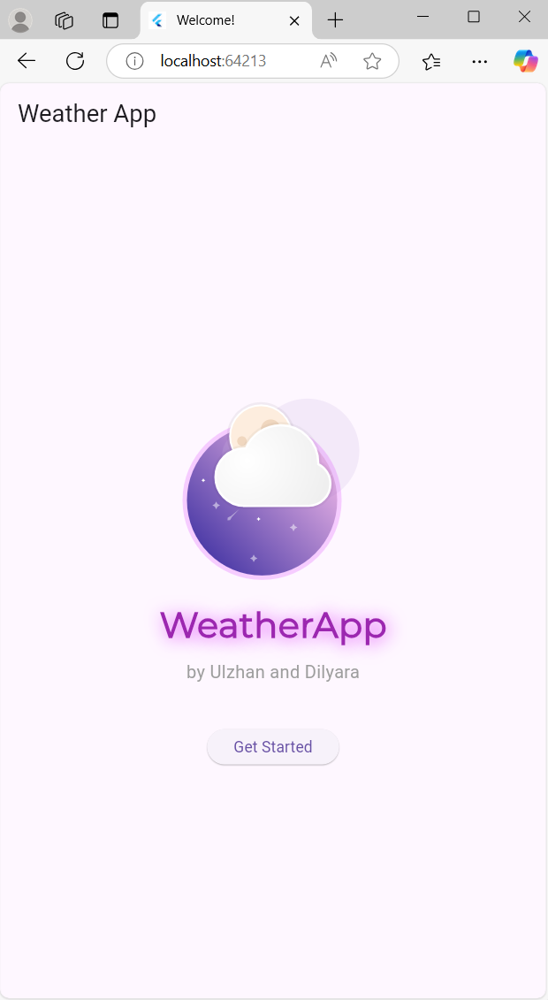
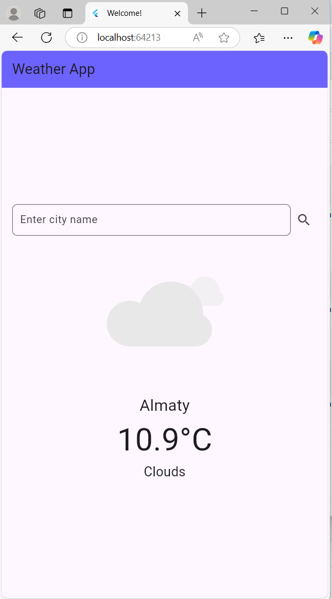

#  WeatherApp (demo)

A sleek Flutter weather application with real-time forecasts, interactive Lottie animations, and AI-powered alerts. Built with Clean Architecture and Bloc state management.

# 📱 Screenshots

<div align="center">
  
  
</div>

## Features
- **Real-time Weather Data**: Fetch current conditions for any city.
- **Dynamic Animations**: Lottie-powered weather visuals (sun, rain, etc.).
- **Smart Alerts**: Threshold-based notifications (e.g., "Carry an umbrella if rain >60%").
- **Clean Architecture**: Separated UI, logic, and data layers.
- **Offline Support**: Cached weather data for 1 hour.

## Tech Stack
- **Flutter**: 3.16+ (Null Safety)
- **State Management**: Bloc/Cubit
- **API**: [OpenWeatherMap](https://openweathermap.org)
- **Animations**: Lottie (`lottie: ^2.7.0`)
- **Networking**: Dio (`dio: ^5.3.0`)

## Installation
1. **Clone the repository**:
   ```bash
   git clone https://github.com/kozqarashigi/weatherapp-demo.git
